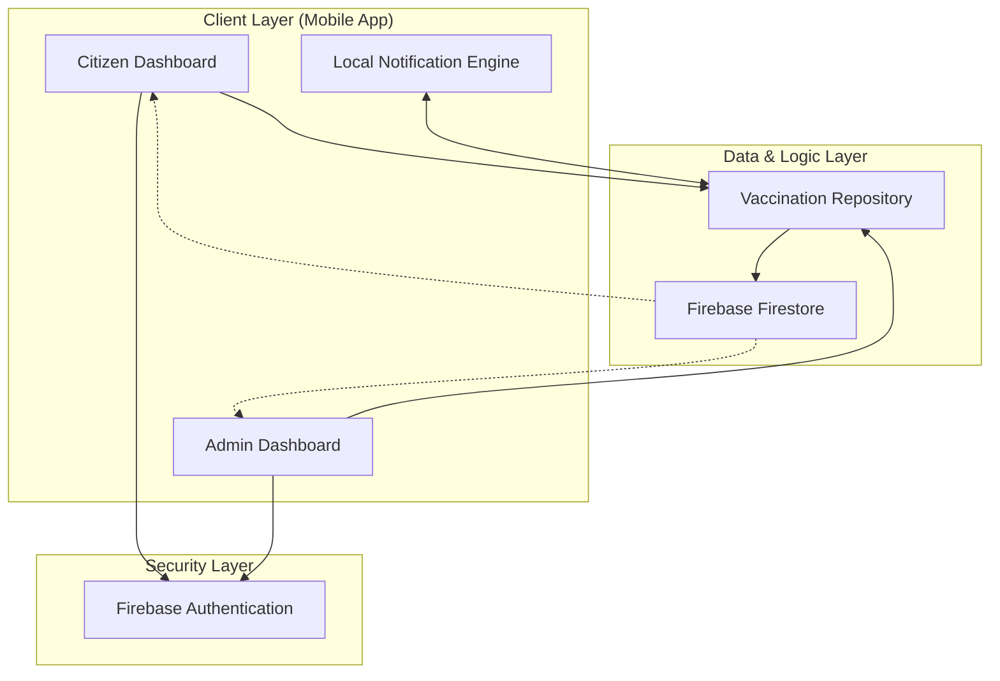

# Project Documentation: Digital Vaccine App (VaxSync)

## 1. Title
**Digital Vaccine App (VaxSync)**  
*A modern, user-centric solution for digitalizing and managing vaccination schedules.*

---

## 2. Objectives
The primary goal of the Digital Vaccine App is to bridge the gap between healthcare providers and citizens by providing a seamless digital platform for immunization tracking.

*   **Centralized Tracking**: Replace physical vaccination cards with a secure, cloud-based digital record.
*   **Automated Reminders**: Reduce missed doses through smart, status-aware notifications and personal reminders.
*   **Family-Centric Management**: Enable a single user to manage vaccination schedules for multiple family members (infants, children, elderly).
*   **Admin Oversight**: Provide health administrators with tools to manage vaccine inventory and track community-wide vaccination progress.
*   **Premium User Experience**: Deliver a modern, "Premium Teal" aesthetic that is accessible and intuitive for all age groups.

---

## 3. System Architecture

The application follows a **Client-Server Architecture** leveraging modern cloud services and native Android components.

### Architecture Diagram

### Components:
*   **Frontend**: Native Android (Java) using Material Design 3 for a responsive and premium UI.
*   **Database**: **Firebase Firestore** for real-time data synchronization and offline persistence.
*   **Security**: **Firebase Auth** for role-based access control (RBAC) between Admins and Citizens.
*   **Reminders**: **Android AlarmManager** integrated with a `BroadcastReceiver` for precise, offline-capable notifications.

---

## 4. Modules

### 4.1 Authentication & Profile Module
This module handles the secure onboarding of users. It differentiates between:
*   **Citizen Role**: Access to personal and family records via mobile number authentication.
*   **Admin Role**: Full system access to manage global settings and inventories.

### 4.2 Citizen Dashboard (Personalized Experience)
The core interface for regular users.
*   **Summary Cards**: Instant visibility of "Completed" vs. "Pending" vaccine counts.
*   **Family Switcher**: Quickly toggle between different family members to see their specific schedules.
*   **Quick Actions**: Streamlined access to "My Vaccines," "Family Members," and "Reminders."

### 4.3 Vaccination Records Module
A comprehensive list of all scheduled and taken vaccines.
*   **Status Badge**: Color-coded indicators (Orange for Pending, Green for Completed).
*   **Smart Filtering**: Shows only relevant records for the selected family member.
*   **Detail View**: Clean, clutter-free summary of vaccine name, dose, date, hospital, and status.

### 4.4 Smart Reminder System
A proactive module designed to ensure no vaccine dose is missed.
*   **One-Click Scheduling**: Automatically fetches date and time from records to pre-fill reminder forms.
*   **Detailed Notifications**: Alerts include the family member's name, vaccine type, and location.
*   **Offline Support**: Alarms are scheduled locally on the device to work even without an internet connection.

### 4.5 Admin Inventory & Management
The "Control Center" for system administrators.
*   **Master Vaccine Inventory**: Add, edit, or remove vaccines from the global system registry.
*   **Beneficiary Management**: View and filter all registered citizens across the entire platform.
*   **System Stats**: Track total user growth and vaccination coverage rates.

---

## 5. Conclusion
The Digital Vaccine App represents a significant step forward in digital health management. By focusing on a **user-first design** and **automated data flow**, the app removes the administrative burden from citizens while providing health officials with accurate, real-time data. The implementation of role-based dashboards, status-aware reminders, and a premium aesthetic ensures that the platform is not just functional, but also delightful to use, ultimately leading to higher immunization rates and a healthier community.
